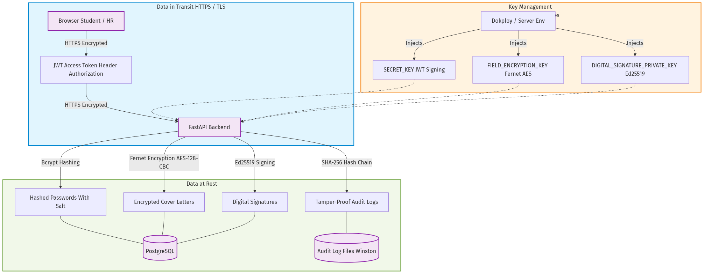

# Keamanan Aplikasi TUMBUH — Dokumentasi Lengkap

> Dokumen ini menjelaskan seluruh aspek keamanan yang diimplementasikan pada aplikasi TUMBUH, platform karir dan magang IPB University. Mencakup Authentication, Authorization, Accounting (AAA), enkripsi, tanda tangan digital, dan keamanan deployment.

---

## Daftar Isi

1. [Arsitektur Keamanan Umum](#1-arsitektur-keamanan-umum)
2. [Authentication (Autentikasi)](#2-authentication-autentikasi)
3. [Authorization (Otorisasi)](#3-authorization-otorisasi)
4. [Accounting / Audit Logging](#4-accounting--audit-logging)
5. [Password Hashing & Salting](#5-password-hashing--salting)
6. [Enkripsi & Dekripsi (Field-Level Encryption)](#6-enkripsi--dekripsi-field-level-encryption)
7. [Digital Signature / Non-Repudiation](#7-digital-signature--non-repudiation)
8. [Security Headers & Middleware](#8-security-headers--middleware)
9. [Rate Limiting](#9-rate-limiting)
10. [CORS (Cross-Origin Resource Sharing)](#10-cors-cross-origin-resource-sharing)
11. [File Upload Security](#11-file-upload-security)
12. [Email Verification & Transactional Emails](#12-email-verification--transactional-emails)
13. [Deployment & Secret Management](#13-deployment--secret-management)
14. [Library & Dependency Security Map](#14-library--dependency-security-map)
15. [Alur Proses Keamanan End-to-End](#15-alur-proses-keamanan-end-to-end)

---

## 1. Arsitektur Keamanan Umum

TUMBUH menerapkan model keamanan **AAA (Authentication, Authorization, Accounting)** secara menyeluruh:

```
┌─────────────────────────────────────────────────────────────────────┐
│                        TUMBUH Architecture                         │
│                                                                     │
│  ┌──────────────┐    ┌──────────────────┐    ┌──────────────────┐  │
│  │  Frontend     │    │  Backend (API)    │    │  Audit Log       │  │
│  │  React/Vite   │◄──►│  FastAPI/Python   │───►│  Express/Winston │  │
│  │  fe-web/      │    │  be-web/          │    │  audit-log/      │  │
│  └──────────────┘    └──────────────────┘    └──────────────────┘  │
│         │                     │                       │             │
│    localStorage          PostgreSQL              Log Files          │
│    (JWT tokens)          (Supabase)         (Daily Rotate + Chain)  │
│                               │                                     │
│                    ┌──────────────────┐                             │
│                    │  SecurityService  │                             │
│                    │  • Fernet (AES)   │                             │
│                    │  • Ed25519 Sigs   │                             │
│                    └──────────────────┘                             │
└─────────────────────────────────────────────────────────────────────┘
```

**Komponen utama:**
- **Frontend** (`fe-web/`): React + Vite, menyimpan JWT di localStorage, mengirim token via header `Authorization: Bearer`.
- **Backend** (`be-web/`): FastAPI + SQLAlchemy + Alembic, menangani seluruh logika bisnis dan keamanan.
- **Audit Log** (`audit-log/`): Microservice Express.js + Winston, menerima event audit secara fire-and-forget dari backend.
- **Database**: PostgreSQL (via Supabase di production).

### 1.1 Diagram Data at Rest, In Transit & Key Management



---

## 2. Authentication (Autentikasi)

### 2.1 Email/Password Authentication

**Library yang digunakan:**
- `bcrypt==4.2.0` — hashing password
- `python-jose[cryptography]==3.3.0` — JWT encode/decode (HMAC-SHA256)
- `email-validator==2.1.0` — validasi format email

**Proses Registrasi:**

```
User → POST /api/v1/auth/register → AuthService.register()
  1. Validasi email format (Pydantic EmailStr + email-validator)
  2. Validasi domain institusional (student harus @ipb.ac.id)
  3. Cek duplikasi email di database
  4. Hash password dengan bcrypt (auto-generate salt)
  5. Buat verification token (secrets.token_urlsafe(32))
  6. Hash verification token (SHA-256) untuk storage
  7. Simpan user dengan is_email_verified=False
  8. Kirim email verifikasi via Resend API
  9. Log audit event AUTH_REGISTER
  10. Return RegistrationResponse (tanpa hashed_password)
```

**File terkait:**
- `be-web/app/services/auth_service.py` — `AuthService.register()` (line 84–138)
- `be-web/app/schemas/user.py` — `UserCreate` schema dengan validasi
- `be-web/app/api/routes/auth.py` — route `POST /auth/register` (line 22–30)

**Proses Login:**

```
User → POST /api/v1/auth/login → AuthService.login()
  1. Lookup user by email
  2. Verifikasi password via bcrypt.checkpw()
  3. Cek is_email_verified == True
  4. Cek is_active == True
  5. Buat access_token (JWT, expire 60 menit)
  6. Buat refresh_token (JWT, expire 7 hari)
  7. Log audit event AUTH_LOGIN_SUCCESS
  8. Return TokenResponse (access_token + refresh_token + user)
```

**File terkait:**
- `be-web/app/services/auth_service.py` — `AuthService.login()` (line 140–200)
- `be-web/app/api/routes/auth.py` — route `POST /auth/login` (line 55–63)

### 2.2 Google OAuth Authentication

**Library yang digunakan:**
- `google-auth==2.45.0` — verifikasi Google ID token

**Proses Google Sign-in / Sign-up:**

```
User → POST /api/v1/auth/google → AuthService.google_auth()
  1. Verifikasi Google ID token via google.oauth2.id_token.verify_oauth2_token()
     - Validasi token signature (Google public key)
     - Validasi audience (GOOGLE_CLIENT_ID)
     - Validasi token expiry
  2. Extract email, google_sub dari payload
  3. Validasi email_verified dari Google
  4. Validasi domain institusional (student harus @ipb.ac.id)
  5. Cek existing user by google_sub atau email
  6. Jika HR: wajib input manual first_name & last_name
     (tidak trust Gmail display name secara buta)
  7. Jika baru: create user, set auth_provider="google", is_email_verified=True
  8. Generate access_token + refresh_token
  9. Log audit event AUTH_GOOGLE_SIGNUP
  10. Return TokenResponse
```

**Mengapa HR harus input nama manual:**
- Google display name bisa berisi nickname atau karakter tidak diinginkan
- Untuk konteks HR/perusahaan, nama resmi diperlukan
- Validasi di `_resolve_google_names()`: jika role HR dan first/last name kosong → error 400

**File terkait:**
- `be-web/app/services/auth_service.py` — `AuthService.google_auth()` (line 234–282)
- `be-web/app/services/auth_service.py` — `AuthService._resolve_google_names()` (line 428–444)

### 2.3 JWT Token System

**Algoritma:** HS256 (HMAC-SHA256)
**Library:** `python-jose[cryptography]==3.3.0`

**Struktur Token:**

```json
// Access Token
{
  "sub": "123",        // user ID
  "role": "student",   // user role
  "exp": 1717345678,   // expiry time (60 menit dari sekarang)
  "type": "access"     // tipe token
}

// Refresh Token
{
  "sub": "123",
  "role": "student",
  "exp": 1717950478,   // expiry time (7 hari dari sekarang)
  "type": "refresh"
}
```

**Konfigurasi (dari `settings.py`):**
- `SECRET_KEY` — kunci rahasia untuk signing JWT
- `ALGORITHM` = `"HS256"` — algoritma signing
- `ACCESS_TOKEN_EXPIRE_MINUTES` = `60` — masa berlaku access token
- `REFRESH_TOKEN_EXPIRE_DAYS` = `7` — masa berlaku refresh token

**Proses Token Refresh:**

```
Frontend → POST /api/v1/auth/refresh → AuthService.refresh()
  1. Decode refresh_token dengan SECRET_KEY
  2. Validasi type == "refresh"
  3. Validasi user masih ada dan is_active
  4. Buat access_token baru + refresh_token baru
  5. Log audit event AUTH_TOKEN_REFRESH
  6. Return TokenResponse baru
```

**Frontend Token Management (`fe-web/src/api/client.js`):**
- Token disimpan di `localStorage` ("token" dan "refreshToken")
- Setiap request API, token dikirim via header `Authorization: Bearer {token}`
- Jika API return 401, otomatis coba refresh via `refreshSession()`
- Jika refresh gagal, clear semua token dan redirect ke `/login`
- Race condition handling: flag `_isRefreshing` mencegah refresh paralel

**File terkait:**
- `be-web/app/services/auth_service.py` — `create_access_token()`, `create_refresh_token()`, `decode_token()` (line 56–80)
- `be-web/app/services/auth_service.py` — `AuthService.refresh()` (line 284–316)
- `fe-web/src/api/client.js` — token helpers dan `fetchWithAuth()` (seluruh file)

### 2.4 User Session Extraction

**Dependency injection FastAPI:**

```python
# be-web/app/api/dependencies.py

oauth2_scheme = OAuth2PasswordBearer(tokenUrl="/api/v1/auth/login")

def get_current_user(
    token: str = Depends(oauth2_scheme),
    auth_service: AuthService = Depends(get_auth_service),
) -> User:
    return auth_service.get_current_user(token)
```

**Proses `get_current_user()`:**
1. Extract token dari header `Authorization: Bearer {token}`
2. Decode JWT, validasi signature dan expiry
3. Pastikan `type` bukan "refresh" (cegah penggunaan refresh token untuk API call)
4. Lookup user dari database berdasarkan `sub` (user ID)
5. Validasi `is_active == True`
6. Return user ORM object

---

## 3. Authorization (Otorisasi)

### 3.1 Role-Based Access Control (RBAC)

**Tiga role yang tersedia:**

```python
class UserRole(str, enum.Enum):
    STUDENT = "student"
    HR = "hr"
    ADMIN = "admin"
```

**Implementasi dependency factory:**

```python
# be-web/app/api/dependencies.py

def require_role(required_role: str):
    def _check_role(current_user: User = Depends(get_current_user)) -> User:
        if current_user.role.value != required_role:
            raise HTTPException(
                status_code=status.HTTP_403_FORBIDDEN,
                detail=f"Access denied. Required role: {required_role}",
            )
        return current_user
    return _check_role
```

### 3.2 Endpoint Protection per Role

**Student-only endpoints:**
| Endpoint | Fungsi |
|----------|--------|
| `POST /api/v1/applications` | Submit lamaran |
| `GET /api/v1/applications/me` | Lihat lamaran sendiri |
| `GET/POST /api/v1/bookmarks` | Bookmark opportunity |
| `GET/POST /api/v1/externships` | Kelola pengalaman magang |
| `GET/PUT /api/v1/resumes` | Kelola profil resume |
| `GET/POST /api/v1/company-follows` | Follow perusahaan |

**HR-only endpoints:**
| Endpoint | Fungsi |
|----------|--------|
| `PUT /api/v1/companies/{id}` | Kelola company sendiri |
| `POST /api/v1/opportunities` | Buat opportunity baru |
| `PATCH /api/v1/applications/{id}/status` | Update status applicant |
| `POST /api/v1/applications/bulk-update-status` | Bulk update status |

**Admin-only endpoints:**
| Endpoint | Fungsi |
|----------|--------|
| `GET /api/v1/admin/stats` | Platform statistics |
| `GET /api/v1/admin/users` | List semua users |
| `PATCH /api/v1/admin/users/{id}/toggle-active` | Activate/deactivate user |
| `DELETE /api/v1/admin/users/{id}` | Hapus user |
| `GET /api/v1/admin/companies` | List semua companies |
| `DELETE /api/v1/admin/companies/{id}` | Hapus company |
| `GET /api/v1/admin/opportunities` | List semua opportunities |
| `DELETE /api/v1/admin/opportunities/{id}` | Hapus opportunity |
| `GET /api/v1/admin/security/applications/{id}/signature` | Verifikasi tanda tangan digital |
| `GET /api/v1/admin/security/audit/events` | Baca audit events |
| `GET /api/v1/admin/security/audit/verify-chain` | Verifikasi integritas hash chain |

### 3.3 Ownership Checks

**HR Company Ownership:**
```python
# be-web/app/services/application_service.py

def verify_opportunity_ownership(self, opportunity_id: int, company_id: int | None):
    opp = self._opportunity_repo.get_by_id(opportunity_id)
    if opp.company_id != company_id:
        raise HTTPException(
            status_code=403,
            detail="You can only manage applicants for your own company's opportunities"
        )
```

Setiap kali HR mengubah status applicant, sistem memverifikasi bahwa opportunity yang bersangkutan milik company HR tersebut. Hal ini berlaku untuk:
- `update_status()` — single status update
- `bulk_update_status()` — bulk status update (setiap application dicek satu per satu)

### 3.4 CV Access Control

**File:** `be-web/app/api/routes/users.py` — `_assert_cv_access()` (line 67–88)

```python
def _assert_cv_access(current_user, target_user, application_repo):
    # Owner boleh akses CV sendiri
    if current_user.id == target_user.id:
        return

    # Admin boleh akses semua CV
    if current_user.role.value == "admin":
        return

    # HR boleh akses CV student HANYA jika student punya application
    # ke company milik HR tersebut
    if (current_user.role.value == "hr"
        and current_user.company_id
        and application_repo.student_has_application_with_company(
            target_user.id, current_user.company_id
        )):
        return

    raise HTTPException(status_code=403, detail="You do not have access to this CV")
```

**CV disimpan di direktori privat** (`private_uploads/cvs/`), tidak di-mount sebagai static file. Hanya endpoint yang ter-autentikasi dan ter-autorisasi yang bisa mengakses CV.

### 3.5 Institutional Email Validation

```python
def _validate_registration_identity(self, email: str, role: UserRole):
    if role == UserRole.STUDENT and not email.lower().endswith("ipb.ac.id"):
        raise HTTPException(
            status_code=400,
            detail="Students must use an IPB institutional email.",
        )
```

Mahasiswa hanya boleh mendaftar menggunakan email institusi IPB (`@ipb.ac.id`).

---

## 4. Accounting / Audit Logging

### 4.1 Arsitektur Audit Log

```
Backend (FastAPI)                    Audit Service (Express)
    │                                        │
    │ POST /log (fire-and-forget)            │
    ├───────────────────────────────────────►│
    │   {action, level, userId,              │ 1. Chain event (SHA-256)
    │    userRole, userEmail, ip,            │ 2. Log to file (Winston)
    │    resource, resourceId,               │ 3. Log to console
    │    detail, success}                    │
    │                                        │
    │                                   ┌────┴────┐
    │                                   │  Files   │
    │                                   │audit-*.log│
    │                                   │(rotating) │
    │                                   └──────────┘
```

**Library audit service (`audit-log/package.json`):**
- `winston@^3.17.0` — structured JSON logging
- `winston-daily-rotate-file@^5.0.0` — log rotation harian, max 20MB per file, 30 hari retention
- `express@^5.1.0` — HTTP server untuk menerima events
- `cors@^2.8.5` — CORS middleware
- Node.js built-in `crypto` — SHA-256 hash chain

### 4.2 Backend Audit Client

**File:** `be-web/app/services/audit_service.py`

```python
def audit_log(
    action: str,
    *,
    level: str = "info",
    user_id: Optional[int] = None,
    user_role: str = "anonymous",
    user_email: Optional[str] = None,
    ip: Optional[str] = None,
    resource: Optional[str] = None,
    resource_id: Optional[int] = None,
    detail: str = "",
    success: bool = True,
) -> None:
```

**Karakteristik penting:**
- **Fire-and-forget**: audit call dijalankan di background thread (`threading.Thread(daemon=True)`)
- **Non-blocking**: tidak pernah memperlambat response API ke client
- **Fault-tolerant**: jika audit server unreachable, error di-log locally tapi request tetap berjalan
- **Timeout 2 detik**: konfigurasi via `AUDIT_LOG_TIMEOUT`

### 4.3 Event yang Di-audit

| Event | Resource | Kapan |
|-------|----------|-------|
| `AUTH_REGISTER` | auth | User baru mendaftar |
| `AUTH_REGISTER_DUPLICATE` | auth | Registrasi dengan email duplikat |
| `AUTH_LOGIN_SUCCESS` | auth | Login berhasil |
| `AUTH_LOGIN_FAILURE` | auth | Login gagal (password salah) |
| `AUTH_LOGIN_BLOCKED` | auth | Login user yang dinonaktifkan |
| `AUTH_EMAIL_VERIFY` | auth | Email berhasil diverifikasi |
| `AUTH_GOOGLE_SIGNUP` | auth | Registrasi via Google |
| `AUTH_TOKEN_REFRESH` | auth | Token di-refresh |
| `RATE_LIMIT_EXCEEDED` | system | Rate limit terlampaui |
| `UNHANDLED_ERROR` | system | Error yang tidak tertangani |
| `APPLICATION_SUBMIT` | application | Student submit lamaran |
| `APPLICATION_UPDATE` | application | Student update submission |
| `APPLICATION_STATUS_UPDATE` | application | HR update status applicant |
| `APPLICATION_BULK_STATUS_UPDATE` | application | HR bulk update status |
| `NOTIFICATION_CREATE` | notification | Notifikasi dibuat |
| `AUDIT_SERVER_START` | audit-log | Audit server dimulai |

### 4.4 SHA-256 Hash Chain (Tamper Evidence)

**File:** `audit-log/server.js` — `chainAuditEvent()` (line 96–109)

Setiap audit event di-chain menggunakan hash SHA-256 sehingga pemalsuan log dapat dideteksi:

```javascript
function chainAuditEvent(event) {
  // 1. Ambil hash terakhir (atau 'GENESIS' jika pertama kali)
  const previousHash = loadLastHash();

  // 2. Hitung hash event baru = SHA-256(previousHash + canonical JSON event)
  const eventHash = crypto
    .createHash('sha256')
    .update(`${previousHash}:${canonicalJson(event)}`)
    .digest('hex');

  // 3. Simpan hash terakhir ke file state
  fs.writeFileSync(chainStateFile, JSON.stringify({
    lastHash: eventHash,
    updatedAt: new Date().toISOString()
  }));

  // 4. Return event yang diperkaya dengan hash chain fields
  return {
    ...event,
    previousHash,              // hash dari event sebelumnya
    eventHash,                 // hash dari event ini
    integrityAlgorithm: 'SHA-256 hash chain'
  };
}
```

**Proses verifikasi chain (`verifyAuditChain()`, line 756–820):**
1. Baca semua file log audit secara kronologis
2. Untuk setiap event, verifikasi:
   - `previousHash` cocok dengan `eventHash` dari event sebelumnya
   - `eventHash` cocok dengan hash yang dihitung ulang dari konten event
3. Jika ada ketidakcocokan, laporkan lokasi dan alasan kegagalan pertama
4. Return `valid: true/false` beserta statistik

### 4.5 Audit Dashboard

**Dua lokasi akses dashboard:**

1. **Standalone audit dashboard** — langsung di service audit (`http://localhost:3001/`)
   - Dilindungi oleh `AUDIT_DASHBOARD_KEY` (cookie atau header auth)
   - UI lengkap: event stream, signature check, chain integrity, health

2. **Admin audit page** — terintegrasi di frontend TUMBUH (`/admin/audit`)
   - Dilindungi oleh admin role (JWT + RBAC)
   - Memanggil backend endpoint `/api/v1/admin/security/audit/*`
   - Backend kemudian forward request ke audit service secara internal
   - Tidak mengekspos audit service secara langsung ke frontend

**File terkait:**
- `audit-log/server.js` — standalone dashboard HTML (line 201–725)
- `fe-web/src/pages/admin/AuditLog.jsx` — admin dashboard React component
- `be-web/app/services/admin_service.py` — `get_audit_events()`, `verify_audit_chain()` (line 188–217)
- `be-web/app/api/routes/admin.py` — admin security routes (line 137–153)

### 4.6 Timestamp Format

Semua timestamp di audit dashboard ditampilkan dalam format waktu Indonesia (WIB, Asia/Jakarta) dengan format 24 jam:

```javascript
function formatJakartaTime(date) {
  return new Intl.DateTimeFormat('id-ID', {
    timeZone: 'Asia/Jakarta',
    hour: '2-digit',
    minute: '2-digit',
    second: '2-digit',
    hour12: false,
  }).format(date);
}
```

---

## 5. Password Hashing & Salting

### 5.1 Library

- `bcrypt==4.2.0` — implementasi bcrypt password hashing

### 5.2 Proses Hashing

**File:** `be-web/app/services/auth_service.py` (line 46–52)

```python
@staticmethod
def hash_password(password: str) -> str:
    return _bcrypt.hashpw(
        password.encode("utf-8"),
        _bcrypt.gensalt()          # auto-generate 16-byte random salt
    ).decode("utf-8")

@staticmethod
def verify_password(plain: str, hashed: str) -> bool:
    return _bcrypt.checkpw(
        plain.encode("utf-8"),
        hashed.encode("utf-8")
    )
```

**Detail teknis:**
- `bcrypt.gensalt()` menghasilkan 16-byte salt secara acak
- Salt di-embed langsung dalam hash output (format `$2b$12$<salt><hash>`)
- Default cost factor: 12 rounds (2^12 = 4096 iterasi internal)
- Output hash: 60 karakter string
- Setiap password yang sama akan menghasilkan hash berbeda (karena salt random)

### 5.3 Password Tidak Pernah Di-expose

**Schema response (`UserResponse`) tidak mengandung field `hashed_password`:**

```python
class UserResponse(BaseModel):
    id: int
    email: str
    first_name: str
    last_name: str
    role: UserRole
    # ... field lainnya
    # TIDAK ADA hashed_password di sini

    class Config:
        from_attributes = True
```

Karena `UserResponse` menggunakan `from_attributes = True` (validasi dari ORM), hanya field yang secara eksplisit dideklarasikan di schema yang akan muncul di response. `hashed_password` tidak dideklarasikan sehingga otomatis di-exclude dari semua API response.

---

## 6. Enkripsi & Dekripsi (Field-Level Encryption)

### 6.1 Library

- `cryptography` (sebagai dependency dari `python-jose[cryptography]`) — menyediakan `Fernet` authenticated encryption

### 6.2 SecurityService — Enkripsi

**File:** `be-web/app/services/security_service.py` (line 25–47)

```python
class SecurityService:
    def __init__(self):
        self._settings = get_settings()
        self._fernet = Fernet(self._field_key())  # Inisialisasi Fernet cipher

    def encrypt_text(self, value: str | None) -> str | None:
        if value is None or value.startswith(ENCRYPTED_PREFIX):
            return value  # Jangan double-encrypt
        token = self._fernet.encrypt(value.encode("utf-8")).decode("utf-8")
        return f"{ENCRYPTED_PREFIX}{token}"   # "enc:v1:..." prefix

    def decrypt_text(self, value: str | None) -> str | None:
        if value is None or not value.startswith(ENCRYPTED_PREFIX):
            return value  # Bukan nilai terenkripsi
        token = value.removeprefix(ENCRYPTED_PREFIX).encode("utf-8")
        try:
            return self._fernet.decrypt(token).decode("utf-8")
        except InvalidToken:
            return "[encrypted value could not be decrypted]"
```

### 6.3 Algoritma Fernet

**Fernet = AES-128-CBC + HMAC-SHA256**

Proses enkripsi Fernet:
1. Generate 16-byte IV (Initialization Vector) secara random
2. Enkripsi plaintext dengan AES-128-CBC menggunakan IV
3. Tambahkan HMAC-SHA256 untuk autentikasi (mencegah tampering)
4. Gabungkan: `version | timestamp | IV | ciphertext | HMAC`
5. Encode dengan Base64 URL-safe

**Properti keamanan:**
- **Confidentiality**: AES-128-CBC menyembunyikan konten
- **Integrity**: HMAC-SHA256 mendeteksi perubahan apapun pada ciphertext
- **Freshness**: Timestamp tertanam untuk mendeteksi replay

### 6.4 Key Management

```python
def _field_key(self) -> bytes:
    configured = self._settings.FIELD_ENCRYPTION_KEY
    if configured:
        return configured.encode("utf-8")    # Production: key dari environment

    # Development fallback
    digest = hashlib.sha256(self._settings.SECRET_KEY.encode("utf-8")).digest()
    return base64.urlsafe_b64encode(digest)  # Derive key dari SECRET_KEY
```

**Konfigurasi:**
- Production: set `FIELD_ENCRYPTION_KEY` di environment variables (44 karakter Base64 URL-safe)
- Development: otomatis derive dari `SECRET_KEY` menggunakan SHA-256

### 6.5 Data Yang Dienkripsi

**Cover letter aplikasi:**

```python
# Saat submit/update application (application_service.py):
app_dict = {
    "cover_letter": security_service.encrypt_text(data.cover_letter),
    # ...
}

# Saat baca response (application_service.py, _to_response()):
app.cover_letter = security_service.decrypt_text(encrypted_cover_letter)
response = ApplicationResponse.model_validate(app)
app.cover_letter = encrypted_cover_letter  # Restore encrypted value di ORM
```

**Di database**, cover letter tersimpan sebagai:
```
enc:v1:gAAAAABm... (ciphertext Base64)
```

**Di API response**, cover letter tampil sebagai plaintext normal.

### 6.6 Prefix `enc:v1:`

- Menandai bahwa value sudah terenkripsi
- Mencegah double-encryption (jika value sudah prefixed, skip encrypt)
- Memudahkan migrasi jika algoritma berubah di masa depan (bisa tambah `enc:v2:`)

---

## 7. Digital Signature / Non-Repudiation

### 7.1 Library

- `cryptography` — menyediakan `Ed25519PrivateKey` dan `Ed25519PublicKey`

### 7.2 Algoritma: Ed25519

**Ed25519** adalah algoritma tanda tangan digital berbasis elliptic curve (Curve25519):
- **Private key**: 32 bytes (256-bit)
- **Public key**: 32 bytes
- **Signature**: 64 bytes
- **Keunggulan**: cepat, compact, deterministic, tahan timing attack

### 7.3 SecurityService — Tanda Tangan

**File:** `be-web/app/services/security_service.py` (line 49–66)

```python
def sign_payload(self, payload: dict[str, Any]) -> str:
    canonical = self._canonical_json(payload).encode("utf-8")
    signature = self._private_key.sign(canonical)
    return base64.urlsafe_b64encode(signature).decode("ascii")

def verify_signature(self, payload: dict[str, Any], signature: str) -> bool:
    try:
        raw_signature = base64.urlsafe_b64decode(signature.encode("ascii"))
        self._public_key.verify(
            raw_signature,
            self._canonical_json(payload).encode("utf-8")
        )
        return True
    except Exception:
        return False
```

### 7.4 Canonical JSON

Untuk memastikan payload di-sign secara deterministic:

```python
@staticmethod
def _canonical_json(payload: dict[str, Any]) -> str:
    return json.dumps(payload, sort_keys=True, separators=(",", ":"), default=str)
```

- `sort_keys=True` — keys diurutkan alfabet
- `separators=(",", ":")` — tanpa spasi ekstra
- `default=str` — konversi non-serializable ke string

### 7.5 Event Yang Ditandatangani

**Application submission:**
```python
# application_service.py, _sign_application_event()
payload = security_service.build_application_signature_payload(
    action="APPLICATION_SUBMIT",
    actor_id=student_id,
    student_id=application.student_id,
    opportunity_id=application.opportunity_id,
    status=application.status.value,
    timestamp=now,
)
signature = security_service.sign_payload(payload)
```

**HR status update:**
```python
payload = security_service.build_application_signature_payload(
    action="APPLICATION_STATUS_UPDATE",
    actor_id=company_id,         # HR's company_id sebagai actor
    student_id=...,
    opportunity_id=...,
    status=data.status.value,
    timestamp=...,
)
```

**Bulk HR status update:**
```python
# Setiap application dalam bulk update di-sign individual
action="APPLICATION_BULK_STATUS_UPDATE"
```

### 7.6 Storage di Database

Model `Application` menyimpan tanda tangan:

```python
class Application(Base):
    # ...
    signature_payload: str = Column(Text, nullable=True)       # JSON payload yang di-sign
    digital_signature: str = Column(Text, nullable=True)       # Base64 signature
    signature_algorithm: str = Column(String(50), nullable=True)  # "Ed25519"
```

### 7.7 Verifikasi Signature (Admin-Only)

**Endpoint:** `GET /api/v1/admin/security/applications/{application_id}/signature`

```python
# admin_service.py, verify_application_signature()
def verify_application_signature(self, application_id: int) -> dict:
    application = self._application_repo.get_by_id(application_id)
    # ...
    payload = json.loads(application.signature_payload)
    valid = security_service.verify_signature(payload, application.digital_signature)
    return {
        "application_id": application_id,
        "valid": valid,
        "reason": "Signature matches stored payload." if valid
                  else "Signature does not match stored payload.",
        "algorithm": application.signature_algorithm,
        "payload": payload,
        "public_key": security_service.public_key_pem(),  # PEM format public key
    }
```

### 7.8 Non-Repudiation

Dengan digital signature, tercapai:
- **Student tidak bisa menyangkal** bahwa mereka submit lamaran (payload berisi `student_id`, `timestamp`)
- **HR tidak bisa menyangkal** bahwa mereka mengubah status applicant (payload berisi `actor_id` = company_id)
- **Integritas**: jika payload diubah setelah signing, verifikasi akan gagal
- **Admin bisa audit**: verifikasi bisa dilakukan kapan saja via admin endpoint atau audit dashboard

### 7.9 Key Management untuk Signature

```python
def _signature_private_key(self) -> Ed25519PrivateKey:
    configured = self._settings.DIGITAL_SIGNATURE_PRIVATE_KEY
    if configured:
        seed = base64.urlsafe_b64decode(configured.encode("ascii"))
    else:
        # Development fallback
        seed = hashlib.sha256(
            f"signature:{self._settings.SECRET_KEY}".encode("utf-8")
        ).digest()
    return Ed25519PrivateKey.from_private_bytes(seed[:32])
```

- Production: set `DIGITAL_SIGNATURE_PRIVATE_KEY` di environment (Base64 URL-safe encoded 32-byte seed)
- Development: derive dari `SECRET_KEY` dengan prefix `"signature:"` + SHA-256

---

## 8. Security Headers & Middleware

### 8.1 HTTP Security Headers

**File:** `be-web/app/main.py` (line 101–108)

```python
@application.middleware("http")
async def add_security_headers(request: Request, call_next):
    response: Response = await call_next(request)
    response.headers["X-Content-Type-Options"] = "nosniff"
    response.headers["X-Frame-Options"] = "DENY"
    response.headers["Referrer-Policy"] = "strict-origin-when-cross-origin"
    return response
```

| Header | Nilai | Fungsi |
|--------|-------|--------|
| `X-Content-Type-Options` | `nosniff` | Mencegah browser meng-sniff MIME type, mitigasi serangan berbasis content-type |
| `X-Frame-Options` | `DENY` | Mencegah halaman dimuat dalam iframe (mitigasi clickjacking) |
| `Referrer-Policy` | `strict-origin-when-cross-origin` | Batasi informasi referrer yang dikirim ke origin lain |

### 8.2 Request Logging Middleware

```python
@application.middleware("http")
async def log_requests(request: Request, call_next):
    if request.method == "OPTIONS":
        return await call_next(request)     # Skip CORS preflight

    start = time.time()
    response: Response = await call_next(request)
    duration = round((time.time() - start) * 1000, 2)
    logger.info("%s %s → %s (%sms)", request.method, request.url.path,
                response.status_code, duration)
    return response
```

### 8.3 Global Exception Handlers

**Unhandled errors di-audit:**
```python
@application.exception_handler(Exception)
async def global_exception_handler(request: Request, exc: Exception):
    audit_log(
        "UNHANDLED_ERROR",
        level="error",
        ip=request.client.host if request.client else None,
        resource="system",
        detail=f"Unhandled error on {request.method} {request.url.path}: {exc}",
        success=False,
    )
    return JSONResponse(status_code=500, content={"detail": "Internal server error"})
```

Error detail **tidak** di-expose ke client (hanya "Internal server error"), tapi dicatat di audit log.

---

## 9. Rate Limiting

### 9.1 Library

- `slowapi==0.1.9` — rate limiting middleware untuk FastAPI berbasis IP address

### 9.2 Konfigurasi

**File:** `be-web/app/config/limiter.py`

```python
from slowapi import Limiter
from slowapi.util import get_remote_address

limiter = Limiter(key_func=get_remote_address)
```

### 9.3 Endpoint yang Di-limit

| Endpoint | Limit | Alasan |
|----------|-------|--------|
| `POST /auth/register` | 5/menit | Cegah spam registrasi |
| `POST /auth/login` | 5/menit | Cegah brute-force password |
| `POST /auth/verify-email` | 10/menit | Cegah abuse verifikasi |
| `POST /auth/google` | 10/menit | Cegah abuse OAuth |

### 9.4 Rate Limit Exceeded Handling

```python
@application.exception_handler(RateLimitExceeded)
async def rate_limit_handler(request: Request, exc: RateLimitExceeded):
    audit_log(
        "RATE_LIMIT_EXCEEDED",
        level="warn",
        ip=request.client.host if request.client else None,
        resource="system",
        detail=f"Rate limit exceeded on {request.method} {request.url.path}",
        success=False,
    )
    return JSONResponse(
        status_code=429,
        content={"detail": "Too many requests. Please try again later."},
    )
```

Rate limit exceeded juga di-audit sebagai warning event.

---

## 10. CORS (Cross-Origin Resource Sharing)

### 10.1 Konfigurasi

**File:** `be-web/app/main.py` (line 38–45)

```python
application.add_middleware(
    CORSMiddleware,
    allow_origins=settings.CORS_ORIGINS,
    allow_credentials=True,
    allow_methods=["*"],
    allow_headers=["*"],
)
```

### 10.2 Dynamic CORS Origins

**File:** `be-web/app/config/settings.py` (line 69–108)

```python
CORS_ORIGINS: list[str] = [
    "http://localhost:5173",     # Vite dev default
    "http://localhost:5174",
    "http://localhost:5175",
    "http://localhost:5176",
    "http://127.0.0.1:5173",
    "http://127.0.0.1:5174",
    "http://127.0.0.1:5175",
    "http://127.0.0.1:5176",
    "http://localhost:3000",
]
```

Di production (via environment variable):
```
CORS_ORIGINS=https://tumbuh.me,https://www.tumbuh.me
```

Mendukung format JSON array atau comma-separated via `parse_cors_origins` validator.

---

## 11. File Upload Security

### 11.1 Avatar Upload

**File:** `be-web/app/api/routes/users.py` (line 110–137)

| Aspek | Implementasi |
|-------|-------------|
| MIME type check | Hanya `image/jpeg`, `image/png`, `image/gif`, `image/webp` |
| Size limit | Maksimal 2MB |
| Filename | Regenerated: `{user_id}_{timestamp}.{ext}` (bukan nama asli user) |
| Storage | `uploads/avatars/` (public, served via StaticFiles mount) |
| Cleanup | File avatar lama dihapus saat upload yang baru |

### 11.2 CV Upload

| Aspek | Implementasi |
|-------|-------------|
| MIME type check | Hanya `application/pdf` |
| Size limit | Maksimal 5MB |
| Filename | Regenerated: `{user_id}_{timestamp}.pdf` |
| Storage | `private_uploads/cvs/` (TIDAK di-mount sebagai static) |
| Access | Hanya via endpoint ter-autentikasi dengan otorisasi |
| Cleanup | File CV lama dihapus saat upload yang baru |

### 11.3 CV Privacy

CV files **tidak pernah** bisa diakses langsung via URL static. Aksesnya melalui:
- `GET /api/v1/users/me/cv` — owner saja
- `GET /api/v1/users/{id}/cv` — dengan otorisasi (owner/admin/HR relevan)
- `GET /api/v1/users/{id}/cv/preview` — Base64 JSON response untuk in-app preview

---

## 12. Email Verification & Transactional Emails

### 12.1 Library

- `resend==2.30.1` — Resend email API untuk pengiriman email transaksional

### 12.2 Proses Verifikasi Email

```
1. User register → generate token (secrets.token_urlsafe(32))
2. Hash token (SHA-256) → simpan hash di database
   (token asli TIDAK disimpan di database)
3. Kirim email dengan link: {FRONTEND_URL}/verify-email?token={raw_token}
4. Token expire: 24 jam (EMAIL_VERIFICATION_EXPIRE_HOURS)
5. User klik link → POST /auth/verify-email dengan raw token
6. Backend: hash raw token → cari user by token hash
7. Cek expiry → set is_email_verified=True
8. Hapus token hash dari database (single-use)
```

**Keamanan token verifikasi:**
- Token asli hanya dikirim via email, tidak pernah tersimpan di database
- Yang tersimpan di database adalah **hash SHA-256** dari token
- Jika database bocor, attacker tidak bisa merekonstruksi token asli
- Token single-use: setelah verifikasi, hash dihapus

### 12.3 Notification Emails

**Kapan email notifikasi dikirim:**
- HR: saat ada applicant baru untuk opportunity mereka
- Student: saat status application mereka berubah

**EmailService menggunakan HTML template** yang di-build di backend dengan escaped content (mencegah XSS di email).

**Fail-safe design:** email failure tidak pernah menggagalkan action utama:
```python
def send_notification_email(self, ...) -> bool:
    try:
        self.send_email(...)
        return True
    except Exception:
        logger.exception("Failed to send notification email to %s", to_email)
        return False  # Gagal kirim email = bukan error untuk user
```

---

## 13. Deployment & Secret Management

### 13.1 Docker Compose Architecture

**File:** `docker-compose.dokploy.yml`

```yaml
services:
  postgres:         # PostgreSQL 16 Alpine
  backend:          # FastAPI (build from be-web/)
  frontend:         # React/Vite (build from fe-web/)
  audit-log:        # Express/Winston (build from audit-log/)

volumes:
  postgres_data:    # Persistent database
  audit_logs:       # Persistent audit log files
```

### 13.2 Secret/Credential Management

**Semua secrets di-pass via environment variables, BUKAN hardcoded:**

| Variable | Fungsi | Level |
|----------|--------|-------|
| `SECRET_KEY` | JWT signing, fallback key derivation | Critical |
| `FIELD_ENCRYPTION_KEY` | Fernet encryption key | Critical |
| `DIGITAL_SIGNATURE_PRIVATE_KEY` | Ed25519 private key seed | Critical |
| `POSTGRES_PASSWORD` | Database password | Critical |
| `RESEND_API_KEY` | Email API key | High |
| `GOOGLE_CLIENT_ID` | Google OAuth client ID | High |
| `AUDIT_DASHBOARD_KEY` | Audit dashboard access key | High |
| `CORS_ORIGINS` | Allowed frontend origins | Medium |

### 13.3 Database Migration Security

**File:** `be-web/docker-entrypoint.sh`

```bash
#!/bin/sh
set -eu

# 1. Wait for database to be ready (with timeout)
python - <<'PY'
# ... SQLAlchemy health check with 60s deadline
PY

# 2. Run Alembic migrations
alembic upgrade head

# 3. Start Uvicorn
exec uvicorn app.main:app --host 0.0.0.0 --port "${PORT:-8000}"
```

**Keamanan:** migrations otomatis berjalan saat container start, memastikan schema database selalu up-to-date tanpa intervensi manual.

### 13.4 Frontend Build-time Security

```yaml
frontend:
  build:
    args:
      VITE_API_URL: ${VITE_API_URL:-/api/v1}
      VITE_GOOGLE_CLIENT_ID: ${VITE_GOOGLE_CLIENT_ID:-}
```

- Hanya **non-secret** configuration yang di-pass sebagai build args
- `SECRET_KEY`, `FIELD_ENCRYPTION_KEY`, dan credential lainnya TIDAK pernah ada di frontend code
- API URL dan Google Client ID adalah public information (bukan secret)

---

## 14. Library & Dependency Security Map

### 14.1 Backend (Python) — `be-web/requirements.txt`

| Library | Versi | Fungsi Keamanan |
|---------|-------|-----------------|
| `fastapi` | 0.115.0 | Framework API dengan Pydantic validation, dependency injection, OpenAPI |
| `uvicorn[standard]` | 0.30.0 | ASGI server (HTTP/HTTPS) |
| `sqlalchemy` | 2.0.35 | ORM — parameterized queries mencegah SQL injection |
| `psycopg2-binary` | 2.9.11 | PostgreSQL adapter |
| `pydantic` | 2.9.0 | Input validation & serialization (mencegah injection, type confusion) |
| `pydantic-settings` | 2.5.0 | Environment-based configuration loading |
| `python-jose[cryptography]` | 3.3.0 | JWT encoding/decoding (HS256), + cryptography sub-dependency untuk Fernet & Ed25519 |
| `bcrypt` | 4.2.0 | Password hashing dengan salt |
| `python-multipart` | 0.0.9 | File upload parsing (multipart/form-data) |
| `alembic` | 1.13.0 | Database migration management |
| `slowapi` | 0.1.9 | Rate limiting berbasis IP |
| `email-validator` | 2.1.0 | Email format validation (RFC 5321/5322) |
| `resend` | 2.30.1 | Transactional email API client |
| `google-auth` | 2.45.0 | Google OAuth ID token verification |

### 14.2 Audit Log (Node.js) — `audit-log/package.json`

| Library | Versi | Fungsi Keamanan |
|---------|-------|-----------------|
| `express` | ^5.1.0 | HTTP server untuk menerima audit events |
| `winston` | ^3.17.0 | Structured JSON logging |
| `winston-daily-rotate-file` | ^5.0.0 | Log rotation (20MB max, 30 hari retention, ZIP archive) |
| `cors` | ^2.8.5 | CORS middleware |
| Node.js `crypto` | built-in | SHA-256 hash chain calculation |
| Node.js `fs` | built-in | File I/O untuk log dan chain state |

### 14.3 Frontend (React) — Relevant Security Packages

| Library/Fitur | Fungsi Keamanan |
|---------------|-----------------|
| Vite | Build tool — tree-shaking, environment variable injection |
| `localStorage` | JWT token storage |
| `fetch` API + `fetchWithAuth()` | Authenticated HTTP requests dengan auto-refresh |

---

## 15. Alur Proses Keamanan End-to-End

### 15.1 Alur: Student Submit Lamaran

```
┌──────────┐    ┌──────────────────┐    ┌──────────────────┐    ┌──────────────┐
│  Browser  │    │   Backend API    │    │  SecurityService │    │  Audit Log   │
│ (Student) │    │   (FastAPI)      │    │                  │    │  (Winston)   │
└─────┬─────┘    └────────┬─────────┘    └────────┬─────────┘    └──────┬───────┘
      │                   │                       │                      │
      │ POST /applications│                       │                      │
      │ + Bearer token    │                       │                      │
      │──────────────────►│                       │                      │
      │                   │                       │                      │
      │              ①  Decode JWT                │                      │
      │              ②  Validate role=student     │                      │
      │              ③  Check opportunity exists  │                      │
      │              ④  Check no duplicate app    │                      │
      │                   │                       │                      │
      │                   │  encrypt_text(cover)  │                      │
      │                   │──────────────────────►│                      │
      │                   │  "enc:v1:gAAAAA..."   │                      │
      │                   │◄──────────────────────│                      │
      │                   │                       │                      │
      │              ⑤  Save to DB (encrypted)    │                      │
      │                   │                       │                      │
      │                   │  sign_payload(...)     │                      │
      │                   │──────────────────────►│                      │
      │                   │  Ed25519 signature    │                      │
      │                   │◄──────────────────────│                      │
      │                   │                       │                      │
      │              ⑥  Save signature to DB      │                      │
      │                   │                       │                      │
      │                   │  POST /log                                   │
      │                   │  {action:"APPLICATION_SUBMIT"...}            │
      │                   │─────────────────────────────────────────────►│
      │                   │                                              │
      │                   │                                    ⑦  Chain hash
      │                   │                                    ⑧  Write log
      │                   │                                              │
      │              ⑨  decrypt_text(cover) for response                 │
      │                   │                       │                      │
      │  200 OK           │                       │                      │
      │  {application data with plaintext cover}  │                      │
      │◄──────────────────│                       │                      │
```

### 15.2 Alur: Admin Verifikasi Tanda Tangan

```
Admin → GET /admin/security/applications/{id}/signature
  │
  ├── ① JWT decode + role check (admin only)
  ├── ② Fetch application from DB
  ├── ③ Parse signature_payload JSON
  ├── ④ security_service.verify_signature(payload, digital_signature)
  │     └── Ed25519 public key verifikasi
  └── ⑤ Return {valid: true/false, reason, algorithm, payload, public_key}
```

### 15.3 Alur: Verifikasi Audit Chain Integrity

```
Admin → GET /admin/security/audit/verify-chain
  │
  ├── ① Backend forward ke audit service /audit/verify-chain
  ├── ② Audit service baca semua file audit-YYYY-MM-DD.log
  ├── ③ Untuk setiap entry:
  │     ├── Parse JSON
  │     ├── Cek previousHash == eventHash entry sebelumnya
  │     └── Recompute eventHash, cek cocok dengan yang tersimpan
  ├── ④ Jika ada mismatch → return {valid: false, firstFailure: {...}}
  └── ⑤ Jika semua cocok → return {valid: true, total: N, latestHash: "..."}
```

---

## Ringkasan Fitur Keamanan

| Aspek | Teknologi | Status |
|-------|-----------|--------|
| Password Hashing | bcrypt (auto-salt, 12 rounds) | ✅ Implementasi |
| JWT Authentication | python-jose HS256 (access + refresh tokens) | ✅ Implementasi |
| Google OAuth | google-auth (ID token verification) | ✅ Implementasi |
| Email Verification | SHA-256 hashed tokens, single-use, 24h expiry | ✅ Implementasi |
| Role-Based Access Control | student / hr / admin dengan dependency injection | ✅ Implementasi |
| Ownership Checks | HR hanya kelola company sendiri | ✅ Implementasi |
| CV Access Control | Owner / Admin / HR relevan saja | ✅ Implementasi |
| Field Encryption | Fernet (AES-128-CBC + HMAC-SHA256) | ✅ Implementasi |
| Digital Signature | Ed25519 pada application events | ✅ Implementasi |
| Non-Repudiation | Signed payload tersimpan + verifikasi admin | ✅ Implementasi |
| Audit Logging | Winston + Express microservice, fire-and-forget | ✅ Implementasi |
| Hash Chain | SHA-256 chaining setiap audit event | ✅ Implementasi |
| Chain Verification | End-to-end integrity check | ✅ Implementasi |
| Rate Limiting | SlowAPI (5-10 req/min pada auth endpoints) | ✅ Implementasi |
| Security Headers | X-Content-Type-Options, X-Frame-Options, Referrer-Policy | ✅ Implementasi |
| CORS | Whitelist-based origins | ✅ Implementasi |
| File Upload Validation | MIME type + size limit + filename regeneration | ✅ Implementasi |
| Secret Management | Environment variables only, no hardcoded secrets | ✅ Implementasi |
| Audit Dashboard | Standalone + integrated admin page | ✅ Implementasi |
| Institutional Email | Student harus @ipb.ac.id | ✅ Implementasi |
| SQL Injection Prevention | SQLAlchemy ORM (parameterized queries) | ✅ Implementasi |
| Input Validation | Pydantic schemas on all endpoints | ✅ Implementasi |
